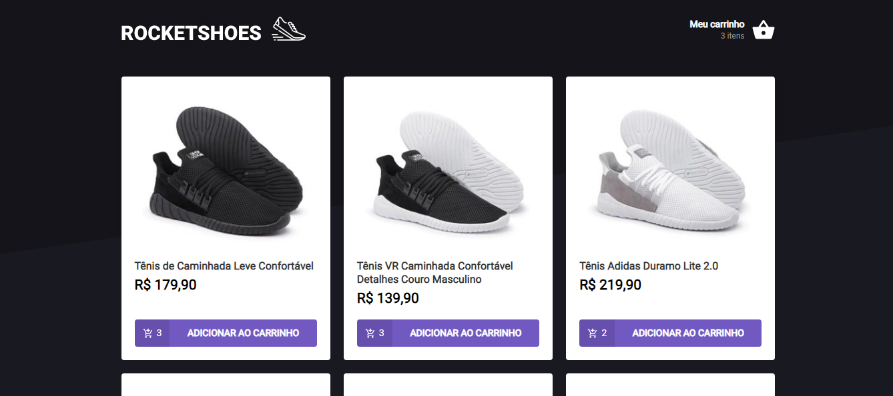

<h1 align="center">
  
</h1>



# RocketShoes
## Desafio 01 - Chapter 02

Neste desafio criamos um hook para gerenciar um carrinho de compras.

Utilizamos localStorage para persistir os itens no carrinho e o Axios para buscar os dados dos produtos e quantidade no stock utilizando uma Fake API com JSON Server.

## Features
- Adicionar um ou mais produtos ao carrinho
- Não permitir que seja adicionado quantidade maior do que tem no estoque
- Aumentar ou Diminuir quantidade do mesmo produto no carrinho
- Remover produto do carrinho

## Utilizamos
- ReactJS
- Axios
- JSON Server
- React-toastify
- localStorage

## Executando o projeto

Utilize o **yarn** ou o **npm install** para instalar as dependências do projeto.

Inicie a Fake API utilizando:
```yarn server``` ou ```npm run server```

Em seguida execute o comando
```yarn start``` ou ```npm run start```
para iniciar o projeto

## Estrutura
Foi utilizado o template disponibilizado pela Rocketseat contendo toda estrutura e estilo da aplicação.

### Dev
[](https://www.linkedin.com/in/joilsonmslopes/)